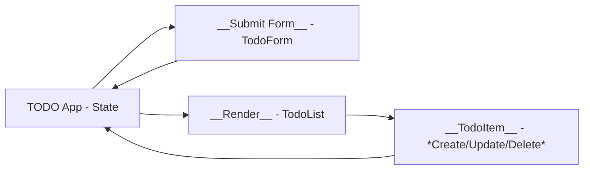

# 📝 React Todo App Tutorial — with Clear State/Props & HTTP Mental Model

> Goal: build a **minimal, production-grade** Todo app in React (JavaScript), while explaining **what states,props and components are**, how to use them, and **how HTTP methods** map to UI actions. You’ll finish with a working app and a **solid mental model** for CRUD ops using React over HTTP.

---

## 🧠 Mental Model First

Think in three layers:

1. **UI (React components)** — renders data, captures user actions.
2. **State** — the single source of truth in the UI (in-memory), synchronized with the server.
3. **HTTP API** — persistence layer (remote). We talk to it via `fetch()`.

### CRUD ↔ HTTP ↔ UI mapping

| User action             | HTTP               | Endpoint     | Body                             | UI state change                                    |
| ----------------------- | ------------------ | ------------ | -------------------------------- | -------------------------------------------------- |
| Load todos on page open | **GET**            | `/todos`     | —                                | `setTodos([...])` (replace state with server list) |
| Add new todo            | **POST**           | `/todos`     | `{ title, completed:false }`     | Append new todo to state                           |
| Toggle complete         | **PATCH** (or PUT) | `/todos/:id` | `{ completed: !todo.completed }` | Update one item in state                           |
| Edit title              | **PATCH** (or PUT) | `/todos/:id` | `{ title }`                      | Update one item in state                           |
| Delete todo             | **DELETE**         | `/todos/:id` | —                                | Remove item from state                             |

Notes:

* **PATCH vs PUT**: Use **PATCH** to update only a subset of fields (less risk of overwriting). Use **PUT** to replace the resource.
* **Pessimistic vs Optimistic updates**: We’ll do **pessimistic** (update UI **after** server confirms) for simplicity and correctness.

---

## 📦 Project Setup

You can paste these files into any React setup (Vite, CRA, Next). I’ll show commands with **Vite** (fast and simple).

```bash
# 1) Create the app
npm create vite@latest react-todo-httppattern -- --template react
cd react-todo-httppattern

# 2) Install deps
npm i

# 3) For a quick mock API, install json-server
npm i -D json-server
```

Add the following to your **package.json** scripts for a dev API:

```json
{
  "scripts": {
    "dev": "vite",
    "api": "json-server --watch db.json --port 5174 --delay 400"
  }
}
```

Create **db.json** in the project root:

```json
{
  "todos": [
    { "id": 1, "title": "Learn React state", "completed": false },
    { "id": 2, "title": "Map UI to HTTP", "completed": true }
  ]
}
```

Run both servers (in two terminals):

```bash
npm run api     # http://localhost:5174
npm run dev     # http://localhost:5173
```

> **Why two ports?** Frontend on 5173, API on 5174 to avoid conflicts. We’ll call `http://localhost:5174/todos`.

---

## 🧩 File 1: API Client (fetch wrappers)

Create **src/api.js** — a tiny layer that isolates HTTP details from UI logic.

```js
const BASE = "http://localhost:5174";

export async function listTodos() {
  const res = await fetch(`${BASE}/todos`);
  if (!res.ok) throw new Error("Failed to load todos");
  return res.json();
}

export async function createTodo(title) {
  const res = await fetch(`${BASE}/todos`, {
    method: "POST",
    headers: { "Content-Type": "application/json" },
    body: JSON.stringify({ title, completed: false })
  });
  if (!res.ok) throw new Error("Failed to create todo");
  return res.json();
}

export async function updateTodo(id, patch) {
  const res = await fetch(`${BASE}/todos/${id}`, {
    method: "PATCH",
    headers: { "Content-Type": "application/json" },
    body: JSON.stringify(patch)
  });
  if (!res.ok) throw new Error("Failed to update todo");
  return res.json();
}

export async function deleteTodo(id) {
  const res = await fetch(`${BASE}/todos/${id}`, { method: "DELETE" });
  if (!res.ok) throw new Error("Failed to delete todo");
  return true;
}
```

**What just happened (state/props focus):** Nothing yet — this is the networking layer. Our UI will **call** these and then **set state** with the results.

---

## 🧩 File 2: React Components

We’ll keep it simple but scalable:

* `App` — owns the **state** (array of todos) and passes data & callbacks **down** via **props**.
* `TodoForm` — controlled input to create a todo.
* `TodoList` — renders list; receives todos via props and emits events (toggle, edit, delete).
* `TodoItem` — a single todo row with toggle/edit/delete controls.

### Component tree & data flow




### `src/App.jsx`

```jsx
import { useEffect, useState } from "react";
import { listTodos, createTodo, updateTodo, deleteTodo } from "./api";

function TodoForm({ onAdd }) {
  const [title, setTitle] = useState("");

  const submit = async (e) => {
    e.preventDefault();
    if (!title.trim()) return;
    await onAdd(title.trim()); // parent handles HTTP + state
    setTitle(""); // local state reset after success
  };

  return (
    <form onSubmit={submit} style={{ display: "flex", gap: 8 }}>
      <input
        value={title}
        onChange={(e) => setTitle(e.target.value)}
        placeholder="Add a todo"
        aria-label="New todo title"
      />
      <button type="submit">Add</button>
    </form>
  );
}

function TodoItem({ todo, onToggle, onEdit, onDelete }) {
  const [isEditing, setIsEditing] = useState(false);
  const [draft, setDraft] = useState(todo.title);

  const save = async () => {
    if (draft.trim() && draft !== todo.title) {
      await onEdit(todo.id, draft.trim());
    }
    setIsEditing(false);
  };

  return (
    <li style={{ display: "flex", alignItems: "center", gap: 8 }}>
      <input
        type="checkbox"
        checked={todo.completed}
        onChange={() => onToggle(todo.id, !todo.completed)}
        aria-label={`Toggle ${todo.title}`}
      />

      {isEditing ? (
        <>
          <input value={draft} onChange={(e) => setDraft(e.target.value)} />
          <button onClick={save}>Save</button>
          <button onClick={() => { setIsEditing(false); setDraft(todo.title); }}>Cancel</button>
        </>
      ) : (
        <>
          <span style={{ textDecoration: todo.completed ? "line-through" : "none" }}>
            {todo.title}
          </span>
          <button onClick={() => setIsEditing(true)}>Edit</button>
        </>
      )}

      <button onClick={() => onDelete(todo.id)} aria-label={`Delete ${todo.title}`}>
        Delete
      </button>
    </li>
  );
}

function TodoList({ todos, onToggle, onEdit, onDelete }) {
  if (todos.length === 0) return <p>No todos yet. Add one!</p>;
  return (
    <ul style={{ display: "grid", gap: 8, padding: 0 }}>
      {todos.map((t) => (
        <TodoItem
          key={t.id}
          todo={t}
          onToggle={onToggle}
          onEdit={onEdit}
          onDelete={onDelete}
        />
      ))}
    </ul>
  );
}

export default function App() {
  const [todos, setTodos] = useState([]); // 🔹 UI state lives here
  const [loading, setLoading] = useState(true);
  const [error, setError] = useState(null);

  // INITIAL LOAD: GET /todos -> setTodos
  useEffect(() => {
    (async () => {
      try {
        setLoading(true);
        const data = await listTodos();
        setTodos(data);
      } catch (err) {
        setError(err.message);
      } finally {
        setLoading(false);
      }
    })();
  }, []);

  // CREATE: POST /todos -> append to state
  async function handleAdd(title) {
    const created = await createTodo(title);
    setTodos((prev) => [...prev, created]);
  }

  // TOGGLE: PATCH /todos/:id { completed }
  async function handleToggle(id, completed) {
    const updated = await updateTodo(id, { completed });
    setTodos((prev) => prev.map((t) => (t.id === id ? updated : t)));
  }

  // EDIT: PATCH /todos/:id { title }
  async function handleEdit(id, title) {
    const updated = await updateTodo(id, { title });
    setTodos((prev) => prev.map((t) => (t.id === id ? updated : t)));
  }

  // DELETE: DELETE /todos/:id -> remove from state
  async function handleDelete(id) {
    await deleteTodo(id);
    setTodos((prev) => prev.filter((t) => t.id !== id));
  }

  return (
    <main style={{ maxWidth: 600, margin: "64px auto", padding: 16 }}>
      <h1>Todo — CRUD over HTTP</h1>

      {error && <p style={{ color: "crimson" }}>Error: {error}</p>}
      {loading ? <p>Loading…</p> : (
        <>
          <TodoForm onAdd={handleAdd} />
          <hr />
          <TodoList
            todos={todos}
            onToggle={handleToggle}
            onEdit={handleEdit}
            onDelete={handleDelete}
          />
        </>
      )}

      <section style={{ marginTop: 24, fontSize: 14, color: "#444" }}>
        <h3>What changed when I clicked?</h3>
        <ul>
          <li><b>Add:</b> UI called <code>createTodo()</code> (POST) → server returns new row → UI <code>setTodos([...prev, created])</code>.</li>
          <li><b>Toggle:</b> UI called <code>updateTodo()</code> (PATCH) → server returns updated row → UI replaces the matching item.</li>
          <li><b>Edit:</b> same as Toggle but with <code>{`{ title }`}</code>.</li>
          <li><b>Delete:</b> UI called <code>deleteTodo()</code> (DELETE) → server 200 OK → UI filters it out.</li>
        </ul>
      </section>
    </main>
  );
}
```

### `src/main.jsx`

```jsx
import React from "react";
import ReactDOM from "react-dom/client";
import App from "./App.jsx";

ReactDOM.createRoot(document.getElementById("root")).render(
  <React.StrictMode>
    <App />
  </React.StrictMode>
);
```

---

## 🔍 State vs Props — Continuous Commentary

* `todos` **state** lives in `App`. Child components never mutate it directly; they **request** changes via callbacks (`onAdd`, `onToggle`, `onEdit`, `onDelete`).
* `TodoForm` holds a **local state** `title` just for the input field (a **controlled component**). On submit, it calls `onAdd(title)`.
* `TodoList` receives `todos` as **props**; it doesn’t own the data.
* `TodoItem` receives a single `todo` as **props**; when you tick the checkbox, it calls `onToggle` with the new `completed` value.
* Every server round-trip returns JSON → we **replace/append/filter** items in the `todos` array immutably. This makes React’s diffing predictable.

---

## 🧪 Try These and Observe

1. Add a todo and watch: POST → new item is appended; input clears.
2. Toggle completed: PATCH → item line-through updates.
3. Edit title: switch to edit mode, save → PATCH → list updates.
4. Delete: DELETE → item disappears from UI.

As you perform each, follow the console/network tab: you’ll see the corresponding HTTP method and the subsequent state update.

---

## 🧯 Error Handling & UX (quick wins)

* Wrap `await` calls in try/catch and show a toast or error label.
* Disable buttons while awaiting to prevent duplicate requests.
* For advanced UX, use **optimistic updates** with rollback on error.

Example (optimistic toggle sketch):

```js
async function handleToggle(id, completed) {
  const prev = todos;
  setTodos((p) => p.map((t) => (t.id === id ? { ...t, completed } : t)));
  try {
    const updated = await updateTodo(id, { completed });
    setTodos((p) => p.map((t) => (t.id === id ? updated : t)));
  } catch (e) {
    setTodos(prev); // rollback on failure
  }
}
```

---

## 🧰 Extending the App

* **Filters**: show All / Active / Completed using derived state.
* **Search**: local filter on title.
* **Pagination**: server-side via query params.
* **Auth**: add login and attach token in `api.js` headers.
* **Types**: migrate to TypeScript for safer props/state.

---

## ✅ Recap: The Core Mental Model

* **React state is the UI truth**; we sync it with server responses.
* **Props flow down; events flow up.** Child components don’t own the data; they request changes.
* Each UI action maps to a clear **HTTP method** and endpoint.
* Keep **API calls** separate from components (tiny `api.js`), and keep **state updates immutable**.

You now have a small, real-world Todo that clearly demonstrates **state/props changes** and the **HTTP CRUD** mapping. Keep this pattern and you can scale almost any CRUD UI.
